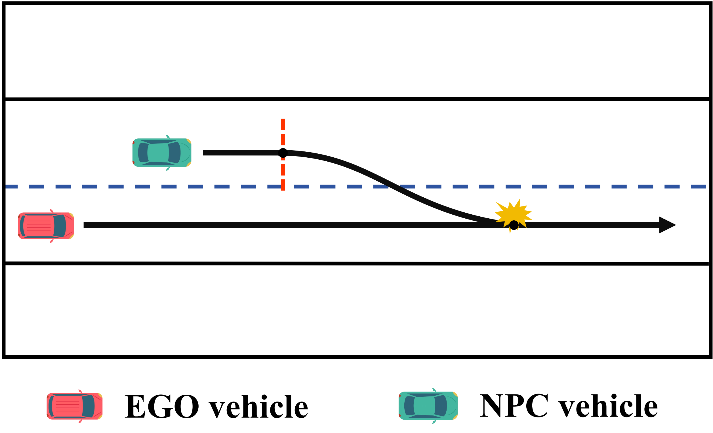

Recently, there has been a significant escalation in both academic and industrial commitment towards the development of autonomous driving systems (ADSs). A number of simulation testing approaches have been proposed to generate diverse driving scenarios for ADS testing. However, scenarios generated by these previous approaches are static and lack interactions between the EGO vehicle and the NPC vehicles, resulting in a large amount of time on average to find violation scenarios. Besides, a large number of the violations they found are caused by aggressive behaviors of NPC vehicles, revealing none bugs of ADS. 

In this work, we propose the concept of adversarial NPC vehicles and introduce AdvFuzz, a novel simulation testing approach, to generate adversarial scenarios on main lanes (e.g., urban roads and highways). AdvFuzz allows NPC vehicles to dynamically interact with the EGO vehicle and regulates the behaviors of NPC vehicles, finding more violation scenarios caused by the EGO vehicle more quickly. We compare AdvFuzz with a random approach and three state-of-the-art scenario-based testing approaches. Our experiments demonstrate that AdvFuzz can generate 198.34\% more violation scenarios compared to the other four approaches in 12 hours and increase the proportion of violations caused by the EGO vehicle to 87.04\%, which is more than 7 times that of other approaches. Additionally, AdvFuzz is at least 51.98\% faster in finding one violation scenario, 92.21\% faster in finding one violation caused by the EGO vehicle, 58.32\% faster in finding the first violation and 82.60\% faster in finding the first violation caused by the EGO vehicle than those of the other approaches.

<!-- <table>
  <tr>
    <td>
      
      
Type 1: EGO rear-ends NPC changing lanes

    </td>
    <td>
      
      
Type 2: EGO hits the side of a NPC

    </td>
  <tr>
    <tr>
    <td>
      
      
Type 3: EGO collides with a NPC

    </td>
    <td>
      
      
Type 4: EGO hits the rear of a NPC

    </td>
  </tr>
  <tr>
    <td>
      
      
Type 5: EGO hits other NPCs stuck on lane

    </td>
    <td>
      
      
Type 6: EGO changes across yellow line

    </td>
  <tr>
    <tr>
    <td>
      
      
Type 7: EGO hits the yellow line. 

    </td>
    <td>
      
      
Type 8: EGO fails to plan trajectory

    </td>
  </tr>
  <tr>
    <td>
      
      
Type 9: EGO hits the rear of an NPC

    </td>
    <td>
      
      
Type 10: EGO side-collides with an NPC

    </td>
  </tr>
  <tr>
    <td>
      
      
Type 11: EGO hits the side of NPC

    </td>
    <td>
      
      
Type 12: EGO collides with NPC

    </td>
  </tr>
  <tr>
    <td>
      
      
Type 13: EGO collides with two NPC vehicles.

    </td>
    <td>
      
      
Type 14: EGO fails to plan trajectory

    </td>
  </tr>
</table>

**Note:** To replicate specific experimental scenarios in this documentation, refer to the data stored in the /records folder.

## Waypoints Generation and Speed Planning

**LEFT_CHANGE maneuver** 

<table>
  <tr>
    <td>
      
      
Waypoints Generation of Adversarial NPC Vehicles

    </td>
    <td>
      
      
Speed Planning of Adversarial NPC Vehicles

    </td>
  </tr>
</table>

**Right_CHANGE maneuver**

<table>
  <tr>
    <td>
      
      
Waypoints Generation of Adversarial NPC Vehicles

    </td>
    <td>
      
      
Speed Planning of Adversarial NPC Vehicles

    </td>
  </tr>
</table>

**ACCELERATION_STRAIGHT maneuver**

<table>
  <tr>
    <td>
      
      
Waypoints Generation of Adversarial NPC Vehicles

    </td>
    <td>
      
      
Speed Planning of Adversarial NPC Vehicles

    </td>
  </tr>
</table>

**DECELERATION_STRAIGHT maneuver**

<table>
  <tr>
    <td>
      
      
Waypoints Generation of Adversarial NPC Vehicles

    </td>
    <td>
      
      
Speed Planning of Adversarial NPC Vehicles

    </td>
  </tr>
</table> -->

## Overview

## Examples of Generated Scenarios
Here are some dynamically generated scenarios using AdvFuzz, showcasing how the EGO vehicle interacts with adversarial NPC vehicles:

|  |  |
|:------------------------:|:------------------------:|
| Type 1: EGO rear-ends NPC changing lanes | Type 2: EGO hits the side of a NPC |
|  |  |
| Type 3: EGO collides with a NPC | Type 4: EGO hits the rear of a NPC |
|  |  |
| Type 5: EGO hits other NPCs stuck on lane | Type 6: EGO changes across yellow line |
|  |  |
| Type 7: EGO hits the yellow line | Type 8: EGO fails to plan trajectory |
|  |  |
| Type 9: EGO hits the rear of an NPC | Type 10: EGO side-collides with an NPC |
|  |  |
| Type 11: EGO hits the side of NPC | Type 12: EGO collides with NPC |
|  |  |
| Type 13: EGO collides with two NPC vehicles. | Type 14: EGO fails to plan trajectory |

**Note:** To replicate specific experimental scenarios in this documentation, refer to the data stored in the `/records` folder.

## Waypoints Generation and Speed Planning

**LEFT_CHANGE maneuver**

|  |  |
|:-------------------------------:|:-------------------------------:|
| Waypoints Generation of Adversarial NPC Vehicles | Speed Planning of Adversarial NPC Vehicles |

**Right_CHANGE maneuver**

|  |  |
|:-------------------------------:|:-------------------------------:|
| Waypoints Generation of Adversarial NPC Vehicles | Speed Planning of Adversarial NPC Vehicles |

**ACCELERATION_STRAIGHT maneuver**

|  |  |
|:-------------------------------:|:-------------------------------:|
| Waypoints Generation of Adversarial NPC Vehicles | Speed Planning of Adversarial NPC Vehicles |

**DECELERATION_STRAIGHT maneuver**

|  |  |
|:-------------------------------:|:-------------------------------:|
| Waypoints Generation of Adversarial NPC Vehicles | Speed Planning of Adversarial NPC Vehicles |
